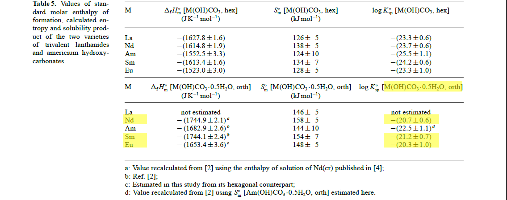

<!-- markdownlint-disable MD014 MD022 MD025 MD033 MD040 -->
# Solubility Constant of Rare Earth Carbonates
{: .no_toc }

## Kozoite

* Formula: Ln(CO<sub>3</sub>)(OH)
* System: Orthogonal

### pK<sub>sp</sub> Summary

The table below summarizes all published values of the solubility products of kozoite in the form of pK<sub>sp</sub>, with:
* pK<sub>sp</sub> = -log10(K<sub>sp</sub>)

* [x]* = Correction of the <em>Ksp</em> value from [x] by Rorif et al., 2005 ([5])

| Ref |Sc|Y |La|Ce|Pr|Nd          |Sm          |Eu          |Gd|Tb|Dy|Ho|Er|Tm|
|:----|:-|:-|:-|:-|:-|:-----------|:-----------|:-----------|:-|:-|:-|:-|:-|:-|
| [1] |  |  |  |  |  |19.19 ± 0.08|            |            |  |  |  |  |  |  |
| [1]*|  |  |  |  |  |20.7  ± 0.02|            |            |  |  |  |  |  |  |
| [2] |  |  |  |  |  |19.94 ± 0.16|            |20.18 ± 0.16|  |  |  |  |  |  |
| [2]*|  |  |  |  |  |21.4  ± 0.3 |            |21.6  ± 0.2 |  |  |  |  |  |  |
| [3] |  |  |  |  |  |20.12 ± 0.09|            |            |  |  |  |  |  |  |
| [3]*|  |  |  |  |  |21.6  ± 0.2 |            |            |  |  |  |  |  |  |
| [4] |  |  |  |  |  |21.3  ± 0.7 |21    ± 0.09|            |  |  |  |  |  |  |
| [5] |  |  |  |  |  |20.7  ± 0.6 |21.2  ± 0.7 |            |  |  |  |  |  |  |
| [6] |  |  |  |  |  |22.3  ± 0.2 |            |            |  |  |  |  |  |  |

#### Calculate K<sub>sp</sub>

K<sub>sp</sub> can be calculated using the following formula:
* K<sub>sp</sub> = 10<sup>-(pKsp)</sup>
* <i>E.g.</i>, K<sub>sp</sub>(koz-Nd) = 10<sup>-22.3</sup> = 5.01x10<sup>-23</sup>

### [1] Meinrath & Kim, 1991
The earliest measurement of the solubility product, <em>K<sub>sp</sub></em>, of kozoite is from Meinrath & Kim (1991) for the single REE phase kozoite-(Nd).

> Meinrath, G. & Kim, J. I., 1991. Solubility products of different Am (III) and Nd (III) carbonates. <em>European Journal of Solid State and Inorganic Chemistry</em>, <b>28 suppl.</b>, 383-388. [Link](https://inis.iaea.org/search/search.aspx?orig_q=RN:23006758){:target="_blank"}

  ```
  log Ksp(koz-Nd) = -19.19 ± 0.08
  ```

### [2] Runde <i>et al.</i>, 1992
A year later, in Runde <i>et al.</i> (1992), the same research group reported <em>K<sub>sp</sub></em> measurements for both kozoite-(Nd) and kozoite-(Eu).

> Runde, W., Meinrath, G. & Kim, J. I., 1991. A study of solid-liquid phase equilibria of trivalent lanthanide. <em>Radiochimica Acta</em>, <b>58/59</b>, 93-100. [doi.org/10.1524/ract.1992.5859.1.93](https://doi.org/10.1524/ract.1992.5859.1.93){:target="_blank"}

<sub>From p.99</sub>


  ```
  log Ksp(koz-Nd) = -19.94 ± 0.16
  log Ksp(koz-Eu) = -20.18 ± 0.16
  ```

### [3] Meinrath & Takeishi, 1993
A year later, in Meinrath <i>et al.</i> (1993), the same research group, this time from Japan, reported <em>K<sub>sp</sub></em> a new and their measurement for the solubility product of kozoite-(Nd).

> Meinrath, G. & Takeishi, H., 1993. Solid-liquid equilibria of Nd<sup>3+</sup> in carbonate solutions. <em>Journal of Alloys and Compounds</em>, <b>194</b>-1, 93-99. [doi.org/10.1016/0925-8388(93)90651-3](https://doi.org/10.1016/0925-8388(93)90651-3){:target="_blank"}

<sub>From p.94</sub>

<sub>From p.96</sub>


  ```
  log Ksp(koz-Nd) = −20.12 ± 0.09
  ```

### [4] Merli & Fuger, 1996
In this paper, Merli & Fuger calculate theoretical solubility products from their estimation of the enthalpy of formation and entropy of the reaction reactants and products. 

> Merli, L. & Fuger, J. 1996. Thermochemistry of Selected Lanthanide and Actinide Hydroxycarbonates and Carbonates. <em>Radiochimica Acta</em>, <b>74</b>, 37-43. [doi.org/10.1524/ract.1996.74.special-issue.37](https://doi.org/10.1524/ract.1996.74.special-issue.37){:target="_blank"}

<sub>From p.42</sub>


```
log Ksp(koz-Nd) = −21.3 ± 0.7
log Ksp(koz-Sm) = −21 ± 0.09
```

### [5] Rorif <i>et al.</i>, 2005
Nine years later, the same research group, in Rorif <i>et al.</i> (2005) recalculated the theoretical solubility products for kozoite-(Nd) and kozoite-(Sm) and calculated the one for kozoite-(Eu). 

> Rorif, F., Fuger, J. & Desreux, J. F. 2005. Thermochemistry of selected trivalent lanthanide and americium compounds: orthorhombic and hexagonal hydroxycarbonates. <em>Radiochimica Acta</em>, <b>93</b>, 103-110. [doi.org/10.1524/ract.93.2.103.59419](https://doi.org/10.1524/ract.93.2.103.59419){:target="_blank"}

<sub>From p.108</sub>


```
log Ksp(koz-Nd) = −20.7 ± 0.6
log Ksp(koz-Sm) = −21.2 ± 0.7
log Ksp(koz-Eu) = −20.3 ± 1
```

### [6] Voigt <i>et al.</i>, 2016
As part of a study dedicated to the characterization of the as-yet unknown solubility of hydroxylbastnäsite, Voigt <i>et al.</i> (2016) carried out dissolution and precipitation experiments of both (Nd|La)(CO3)(OH) polymorphs, kozoite-(Nd) and hydroxylbastnäsite-(Nd|La), to calculate their solubility products.

> Voigt, M., Rodriguez-Blanco, J. D., Vallina, B., Benning, L. G. & Oelkers, E. H. 2016. An experimental study of hydroxylbastnasite solubility in aqueous
solutions at 25 °C. <em>Radiochimica Acta</em>, <b>93</b>, 103-110. [doi.org/10.1524/ract.93.2.103.59419](https://doi.org/10.1524/ract.93.2.103.59419){:target="_blank"}

<sub>From p.73</sub>


```
log Ksp(koz-Nd) = −22.3 ± 0.2
```

<br /><br />

---

<< Back: [Home](index.md)
