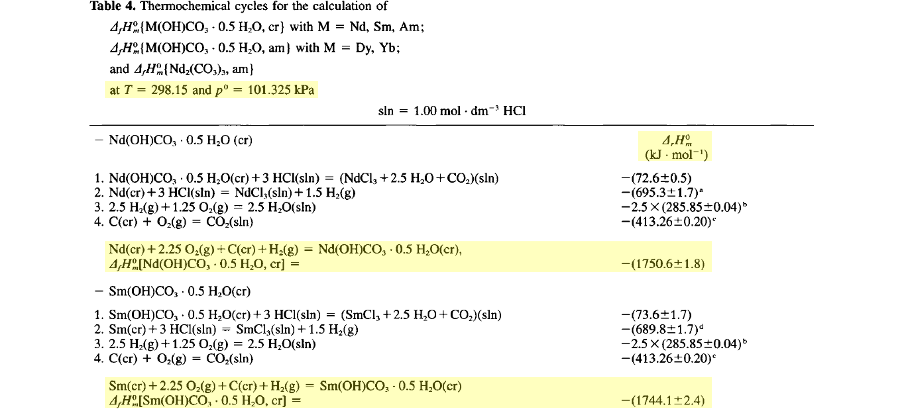
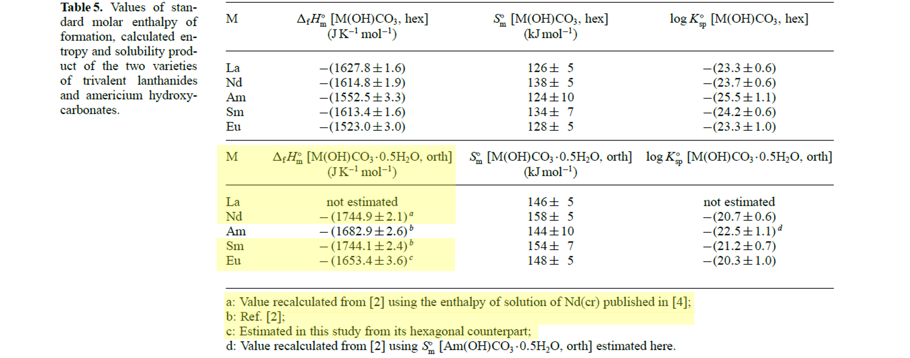

<!-- markdownlint-disable MD014 MD022 MD025 MD033 MD040 -->
# Standard Enthalpy of Formation of Rare Earth Carbonates
{: .no_toc }

## Kozoite

* Formula: Ln(CO<sub>3</sub>)(OH)
* System: Orthogonal

### Summary Table

The table below summarizes all published values of the enthalpies of formation of kozoite in the form.
* Unit: kJ/mol

```
| Ref |Sc|Y |La|Ce|Pr|Nd           |Sm           |Eu           |Gd|Tb|Dy|Ho|Er|Tm|
|-----|--|--|--|--|--|-------------|-------------|-------------|--|--|--|--|--|--|
| [1] |  |  |  |  |  |-1750.6 ± 1.8|-1744.1 ± 2.4|             |  |  |  |  |  |  |
| [2] |  |  |  |  |  |−1744.9 ± 2.1|-1744.1 ± 2.4|−1653.4 ± 3.6|  |  |  |  |  |  |
```


### [1] Merli & Fuger, 1996

The reaction of formation is:
* Ln<sub>(cr)</sub> + 2.25 0<sub>2(g)</sub> + C<sub>(cr)</sub> + H<sub>2(g)</sub> = Ln(0H)C0<sub>3</sub> · 0.5 H<sub>2</sub>0<sub>(cr)</sub>, with Ln = Nd & Sm

```
delta_Hf0 (Nd(0H)C03·0.5H2O) = -1750.6 ± 1.8 kJ/mol
delta_Hf0 (Sm(0H)C03·0.5H2O) = -1744.1 ± 2.4 kJ/mol
delta_Hf0 (Eu(0H)C03·0.5H2O) = -1653.4 ± 3.6 kJ/mol
```

> Merli, L. & Fuger, J. 1996. Thermochemistry of Selected Lanthanide and Actinide Hydroxycarbonates and Carbonates. <em>Radiochimica Acta</em>, <b>74</b>, 37-43. [doi.org/10.1524/ract.1996.74.special-issue.37](https://doi.org/10.1524/ract.1996.74.special-issue.37){:target="_blank"}

<sub>From p.41</sub>


### [2] Rorif <i>et al.</i>, 2005

```
delta_Hf0 (Nd(0H)C03·0.5H2O) = −1744.9 ± 2.1 kJ/mol
delta_Hf0 (Sm(0H)C03·0.5H2O) = −1744.1 ± 2.4 kJ/mol
delta_Hf0 (Eu(0H)C03·0.5H2O) = −1653.4 ± 3.6 kJ/mol
```

> Rorif, F., Fuger, J. & Desreux, J. F. 2005. Thermochemistry of selected trivalent lanthanide and americium compounds: orthorhombic and hexagonal hydroxycarbonates. <em>Radiochimica Acta</em>, <b>93</b>, 103-110. [doi.org/10.1524/ract.93.2.103.59419](https://doi.org/10.1524/ract.93.2.103.59419){:target="_blank"}

<sub>From p.108</sub>


---
